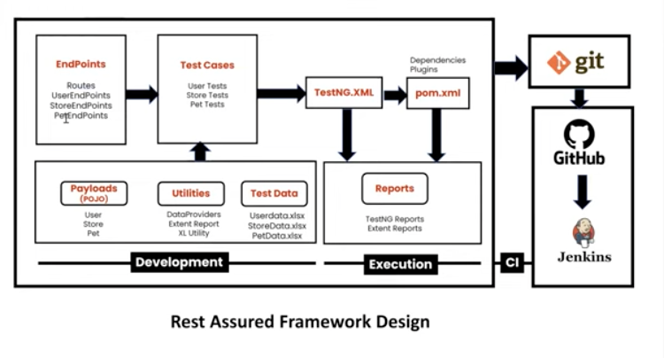
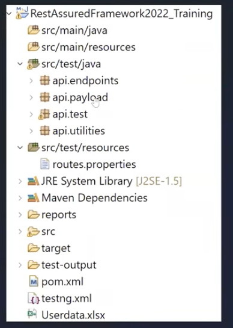

# API FRAMEWORK DEVELOPMENT

This Project is to develop solid api level framework using REST-ASSURED libraries . 

Objectives of the framework : 

* Re-usability
* Maintainability
* Readability

# Hybrid Driven Framework 
This is combination of data driven and keyword driven framework . 

# Phases of Test Automation Development 
* Understanding Requirement 
  - Functional Spec
  - Swagger or contract definitions of services
* Choose Automation Tool 
  - Identify Pros and cons of different tools 
  - Choose the one which best suits to your project need
* Design 
  - Designing the framework like folder structures and what components are needed for automation
* Development 
  - Develop the test automation scripts 
* Execution Logging & Reporting 
  - Execute tests and create appropriate report with features with clear logs details using Log4j.

# Design Overview : 

Endpoints
* Routes has only URL's
* Create each class for each end-points. 

# Folder Structure 
